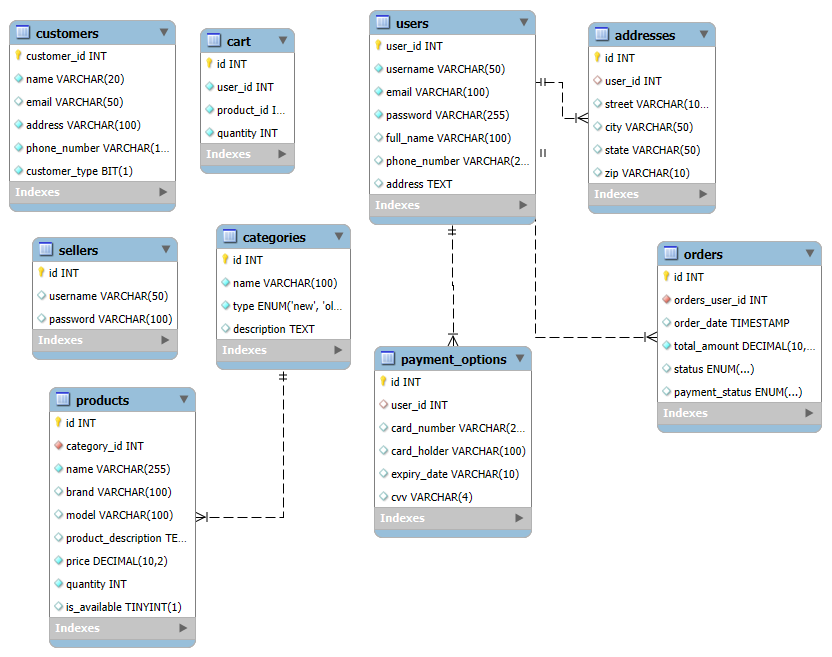

# Ecommerce Project (GUI Based)

> **Note:** Model schema is still being finalized. This document will be updated as changes are made.



---

## 📋 Table of Contents

- [Project Overview](#project-overview)
- [Model Tables](#database-tables)
  - [Users Table](#users)
  - [Categories Table](#categories)
  - [Cart Table](#cart)
  - [Products Table](#products)
  - [Orders Table](#orders)
  - [Sellers Table](#sellers)
  - [Addresses Table](#addresses)
  - [Payment Options Table](#paymentoptions)
  - - [Customer Table](#customers)
- [Sample Data](#sample-data)
- [Usage](#usage)
- [Contributing](#contributing)

---

## 📝 Project Overview

This project is a GUI-based ecommerce platform. The backend is powered by a relational database designed to handle users, products, orders, and more.  
The schema is designed for flexibility and scalability as the project evolves.

---

## 🗄️ Model Tables
### Users

```sql
CREATE TABLE users (
  user_id INT AUTO_INCREMENT PRIMARY KEY,
  username VARCHAR(50) NOT NULL UNIQUE,
  email VARCHAR(100) NOT NULL UNIQUE,
  password VARCHAR(255) NOT NULL,
  full_name VARCHAR(100),
  phone_number VARCHAR(20),
  address TEXT
);
```

[//]: # (Didn't finalized this column yet)

[//]: # (ALTER TABLE users ADD COLUMN user_type VARCHAR&#40;20&#41; NOT NULL;)


---

### Categories

```sql
CREATE TABLE categories (
  id INT AUTO_INCREMENT PRIMARY KEY,
  name VARCHAR(100) NOT NULL,
  type ENUM('new', 'old') NOT NULL,
  description TEXT
);
```

---


### Cart

```sql
CREATE TABLE cart (
  id INT AUTO_INCREMENT PRIMARY KEY,
  user_id INT NOT NULL,
  product_id INT NOT NULL,
  quantity INT NOT NULL DEFAULT 1
);
```

---

### Products


[//]: # (This porduct table is not finalized)

[//]: # (drop table products;)

[//]: # (create table products &#40;)

[//]: # (    id int auto_increment primary key,)

[//]: # (    name varchar&#40;255&#41; not null,)

[//]: # (    brand varchar&#40;100&#41;,)

[//]: # (    model varchar&#40;100&#41;,)

[//]: # (    product_description text,)

[//]: # (    price decimal&#40;10,2&#41; not null ,)

[//]: # (    quantity int not null default 1 check&#40;quantity >=0&#41;,)

[//]: # (    is_available boolean default true)

[//]: # (&#41;;)

ALTER TABLE products ADD COLUMN seller_id INT; -- Not sure about this

[//]: # (Currently using this table for products)

```sql
CREATE TABLE products (
  id INT AUTO_INCREMENT PRIMARY KEY,
  category_id INT NOT NULL,
  name VARCHAR(255) NOT NULL,
  brand VARCHAR(100),
  model VARCHAR(100),
  product_description TEXT,
  price DECIMAL(10,2) NOT NULL,
  quantity INT NOT NULL DEFAULT 1,
  is_available BOOLEAN DEFAULT TRUE,
  FOREIGN KEY (category_id) REFERENCES categories(id) ON DELETE CASCADE
);
```


---

### Orders

```sql
CREATE TABLE orders (
  id INT AUTO_INCREMENT PRIMARY KEY,
  orders_user_id INT NOT NULL,
  order_date TIMESTAMP DEFAULT CURRENT_TIMESTAMP,
  total_amount DECIMAL(10,2) NOT NULL,
  status ENUM('pending', 'confirmed', 'shipped', 'delivered', 'cancelled') DEFAULT 'pending',
  payment_status ENUM('pending', 'paid', 'failed') DEFAULT 'pending',
  FOREIGN KEY (orders_user_id) REFERENCES users(user_id) ON DELETE CASCADE
);
```

---

### Sellers

```sql
CREATE TABLE sellers (
  id INT AUTO_INCREMENT PRIMARY KEY,
  username VARCHAR(50) UNIQUE,
  password VARCHAR(100) -- Consider hashing for security
);
```

---

### Customers
```sql
create table customers
(
    customer_id   int auto_increment
        primary key,
    name          varchar(20)  not null,
    email         varchar(50)  null,
    address       varchar(100) not null,
    phone_number  varchar(11)  not null,
    customer_type bit          not null
);

```
---

### Addresses

```sql
CREATE TABLE addresses (
  id INT AUTO_INCREMENT PRIMARY KEY,
  user_id INT,
  street VARCHAR(100),
  city VARCHAR(50),
  state VARCHAR(50),
  zip VARCHAR(10),
  FOREIGN KEY (user_id) REFERENCES users(user_id)
);
```

---


### PaymentOptions

```sql
CREATE TABLE payment_options (
  id INT AUTO_INCREMENT PRIMARY KEY,
  user_id INT,
  card_number VARCHAR(20),
  card_holder VARCHAR(100),
  expiry_date VARCHAR(10),
  cvv VARCHAR(4),
  FOREIGN KEY (user_id) REFERENCES users(user_id)
);
```

---

## 🧪 Sample Data

<details>
<summary>Click to expand sample data</summary>

```sql

[//]: # (Dummy Data, recommended to use personal)
INSERT INTO products ( name, brand, model, product_description, price, quantity, is_available) VALUES
( 'iPhone 14', 'Apple', '14', 'Latest Apple iPhone with A15 Bionic chip', 999.99, 50, 1),
( 'Samsung Galaxy S21', 'Samsung', 'S21', 'Flagship Samsung Galaxy S21 with 5G support', 799.99, 60, 1),
( 'OnePlus 9', 'OnePlus', '9', 'OnePlus 9 with Snapdragon 888 chipset', 729.99, 55, 1),
( 'Xiaomi Mi 11', 'Xiaomi', 'Mi 11', 'Mi 11 with 108MP camera and Snapdragon 888', 749.99, 40, 1),
( 'Google Pixel 6', 'Google', 'Pixel 6', 'Google Pixel 6 with Google Tensor chip', 599.99, 70, 1),
( 'Sony Xperia 1 III', 'Sony', '1 III', 'Sony Xperia 1 III with 4K OLED display', 1299.99, 30, 1),
( 'Samsung Galaxy A52', 'Samsung', 'A52', 'Samsung Galaxy A52 with AMOLED display', 349.99, 100, 1),
( 'iPhone 13 Pro', 'Apple', '13 Pro', 'iPhone 13 Pro with 120Hz ProMotion display', 1099.99, 45, 1),
( 'Oppo Find X3 Pro', 'Oppo', 'Find X3 Pro', 'Oppo flagship with Snapdragon 888 and 120Hz AMOLED', 1149.99, 25, 1),
( 'Realme GT', 'Realme', 'GT', 'Realme GT with Snapdragon 870 and AMOLED display', 499.99, 80, 1),
( 'Motorola Edge 20', 'Motorola', 'Edge 20', 'Motorola Edge 20 with 108MP camera and 5G support', 649.99, 60, 1),
( 'Xiaomi Redmi Note 10 Pro', 'Xiaomi', 'Redmi Note 10 Pro', 'Redmi Note 10 Pro with 108MP camera', 249.99, 120, 1),
( 'Vivo V21', 'Vivo', 'V21', 'Vivo V21 with 44MP selfie camera', 329.99, 90, 1),
( 'Huawei P40 Pro', 'Huawei', 'P40 Pro', 'Huawei P40 Pro with Leica camera and 5G support', 999.99, 35, 1),
( 'Nokia 8.3 5G', 'Nokia', '8.3 5G', 'Nokia 8.3 5G with Snapdragon 765G and ZEISS camera', 699.99, 50, 1),
( 'Asus Zenfone 8', 'Asus', 'Zenfone 8', 'Asus Zenfone 8 with Snapdragon 888', 649.99, 45, 1),
( 'Motorola Moto G Power', 'Motorola', 'Moto G Power', 'Motorola Moto G Power with large battery', 249.99, 150, 1),
( 'Samsung Galaxy Z Fold 3', 'Samsung', 'Z Fold 3', 'Samsung Galaxy Z Fold 3 with foldable display', 1799.99, 15, 1),
( 'iPhone SE 2020', 'Apple', 'SE 2020', 'iPhone SE with A13 Bionic chip', 399.99, 200, 1),
( 'Xiaomi Poco X3 Pro', 'Xiaomi', 'Poco X3 Pro', 'Poco X3 Pro with Snapdragon 860 and 120Hz display', 249.99, 130, 1),
( 'Google Pixel 5', 'Google', 'Pixel 5', 'Google Pixel 5 with 5G and OLED display', 699.99, 50, 1),
( 'Honor 50', 'Honor', '50', 'Honor 50 with Snapdragon 778G and 108MP camera', 499.99, 60, 1),
( 'iPhone 12', 'Apple', '12', 'iPhone 12 with A14 Bionic chip and 5G support', 699.99, 85, 1),
( 'Samsung Galaxy A32', 'Samsung', 'A32', 'Samsung Galaxy A32 with 90Hz Super AMOLED', 249.99, 160, 1),
( 'Xiaomi Mi 10', 'Xiaomi', 'Mi 10', 'Xiaomi Mi 10 with 108MP camera and Snapdragon 865', 799.99, 45, 1),
( 'Realme 8 Pro', 'Realme', '8 Pro', 'Realme 8 Pro with 108MP quad camera', 299.99, 100, 1),
( 'Oppo Reno 6', 'Oppo', 'Reno 6', 'Oppo Reno 6 with MediaTek Dimensity 900', 499.99, 70, 1),
( 'Vivo Y20', 'Vivo', 'Y20', 'Vivo Y20 with Snapdragon 460 and 5000mAh battery', 149.99, 180, 1);

INSERT INTO categories (id, name) VALUES
(1, 'Electronics'),
(2, 'Mobile Phones'),
(3, 'Laptops'),
(4, 'Accessories');

INSERT INTO products (category_id, name, brand, model, product_description, price, quantity, is_available) VALUES
(2, 'iPhone 14', 'Apple', '14', 'Latest Apple iPhone with A15 Bionic chip', 999.99, 50, 1),
(2, 'Samsung Galaxy S21', 'Samsung', 'S21', 'Flagship Samsung Galaxy S21 with 5G support', 799.99, 60, 1),
(2, 'OnePlus 9', 'OnePlus', '9', 'OnePlus 9 with Snapdragon 888 chipset', 729.99, 55, 1),
(2, 'Xiaomi Mi 11', 'Xiaomi', 'Mi 11', 'Mi 11 with 108MP camera and Snapdragon 888', 749.99, 40, 1),
(2, 'Google Pixel 6', 'Google', 'Pixel 6', 'Google Pixel 6 with Google Tensor chip', 599.99, 70, 1),
(2, 'Sony Xperia 1 III', 'Sony', '1 III', 'Sony Xperia 1 III with 4K OLED display', 1299.99, 30, 1),
(2, 'Samsung Galaxy A52', 'Samsung', 'A52', 'Samsung Galaxy A52 with AMOLED display', 349.99, 100, 1),
(2, 'iPhone 13 Pro', 'Apple', '13 Pro', 'iPhone 13 Pro with 120Hz ProMotion display', 1099.99, 45, 1),
(2, 'Oppo Find X3 Pro', 'Oppo', 'Find X3 Pro', 'Oppo flagship with Snapdragon 888 and 120Hz AMOLED', 1149.99, 25, 1),
(2, 'Realme GT', 'Realme', 'GT', 'Realme GT with Snapdragon 870 and AMOLED display', 499.99, 80, 1),
(2, 'Motorola Edge 20', 'Motorola', 'Edge 20', 'Motorola Edge 20 with 108MP camera and 5G support', 649.99, 60, 1),
(2, 'Xiaomi Redmi Note 10 Pro', 'Xiaomi', 'Redmi Note 10 Pro', 'Redmi Note 10 Pro with 108MP camera', 249.99, 120, 1),
(2, 'Vivo V21', 'Vivo', 'V21', 'Vivo V21 with 44MP selfie camera', 329.99, 90, 1),
(2, 'Huawei P40 Pro', 'Huawei', 'P40 Pro', 'Huawei P40 Pro with Leica camera and 5G support', 999.99, 35, 1),
(2, 'Nokia 8.3 5G', 'Nokia', '8.3 5G', 'Nokia 8.3 5G with Snapdragon 765G and ZEISS camera', 699.99, 50, 1),
(2, 'Asus Zenfone 8', 'Asus', 'Zenfone 8', 'Asus Zenfone 8 with Snapdragon 888', 649.99, 45, 1),
(2, 'Motorola Moto G Power', 'Motorola', 'Moto G Power', 'Motorola Moto G Power with large battery', 249.99, 150, 1),
(2, 'Samsung Galaxy Z Fold 3', 'Samsung', 'Z Fold 3', 'Samsung Galaxy Z Fold 3 with foldable display', 1799.99, 15, 1),
(2, 'iPhone SE 2020', 'Apple', 'SE 2020', 'iPhone SE with A13 Bionic chip', 399.99, 200, 1),
(2, 'Xiaomi Poco X3 Pro', 'Xiaomi', 'Poco X3 Pro', 'Poco X3 Pro with Snapdragon 860 and 120Hz display', 249.99, 130, 1),
(2, 'Google Pixel 5', 'Google', 'Pixel 5', 'Google Pixel 5 with 5G and OLED display', 699.99, 50, 1),
(2, 'Honor 50', 'Honor', '50', 'Honor 50 with Snapdragon 778G and 108MP camera', 499.99, 60, 1),
(2, 'iPhone 12', 'Apple', '12', 'iPhone 12 with A14 Bionic chip and 5G support', 699.99, 85, 1),
(2, 'Samsung Galaxy A32', 'Samsung', 'A32', 'Samsung Galaxy A32 with 90Hz Super AMOLED', 249.99, 160, 1),
(2, 'Xiaomi Mi 10', 'Xiaomi', 'Mi 10', 'Xiaomi Mi 10 with 108MP camera and Snapdragon 865', 799.99, 45, 1),
(2, 'Realme 8 Pro', 'Realme', '8 Pro', 'Realme 8 Pro with 108MP quad camera', 299.99, 100, 1),
(2, 'Oppo Reno 6', 'Oppo', 'Reno 6', 'Oppo Reno 6 with MediaTek Dimensity 900', 499.99, 70, 1),
(2, 'Vivo Y20', 'Vivo', 'Y20', 'Vivo Y20 with Snapdragon 460 and 5000mAh battery', 149.99, 180, 1);

INSERT INTO users (username, email, acc_password, user_type, full_name, phone_number, address) VALUES
('ahmed_siddiqui', 'ahmed.siddiqui@example.com', 'password123', 'buyer', 'Ahmed Siddiqui', '03011234567', '123 Main
Street, Lahore, Pakistan'),
('fatima_khan', 'fatima.khan@example.com', 'password456', 'seller', 'Fatima Khan', '03123456789', '456 Faisal Town,
Karachi, Pakistan'),
('ali_zaidi', 'ali.zaidi@example.com', 'password789', 'buyer', 'Ali Zaidi', '03211234567', '789 Gulberg, Islamabad,
Pakistan'),
('hassan_abbas', 'hassan.abbas@example.com', 'password101', 'seller', 'Hassan Abbas', '03334567890', '101 Johar Town,
Lahore, Pakistan'),
('layla_bashir', 'layla.bashir@example.com', 'password202', 'buyer', 'Layla Bashir', '03451234567', '202 Bahria Town,
Rawalpindi, Pakistan'),
('muhammad_akhtar', 'muhammad.akhtar@example.com', 'password303', 'seller', 'Muhammad Akhtar', '03567890123', '303 Model
Town, Karachi, Pakistan'),
('sara_shah', 'sara.shah@example.com', 'password404', 'buyer', 'Sara Shah', '03678901234', '404 Green Street, Quetta,
Pakistan'),
('bilal_rahman', 'bilal.rahman@example.com', 'password505', 'seller', 'Bilal Rahman', '03789012345', '505 F-10,
Islamabad, Pakistan'),
('zahra_jamil', 'zahra.jamil@example.com', 'password606', 'buyer', 'Zahra Jamil', '03890123456', '606 Peshawar Road,
Lahore, Pakistan'),
('omar_mirza', 'omar.mirza@example.com', 'password707', 'seller', 'Omar Mirza', '03901234567', '707 Rawalpindi,
Pakistan');

```
</details>
---

## 📊 Quick SQL Queries

```sql
SELECT * FROM users;
SELECT * FROM products;
SELECT * FROM orders;
SELECT * FROM categories;
SELECT * FROM cart;
SELECT * FROM order_products;
```

---

## ✨ Features

- User registration and authentication
- Product catalog with categories
- Shopping cart functionality
- Order management
- Seller and buyer roles
- Address and payment management

---

## 🚀 Usage

1. Clone the repository.
2. Set up your database using the provided schema.
3. Insert sample data if needed.
4. Run the application.

---


**Enjoy building your ecommerce platform!**


